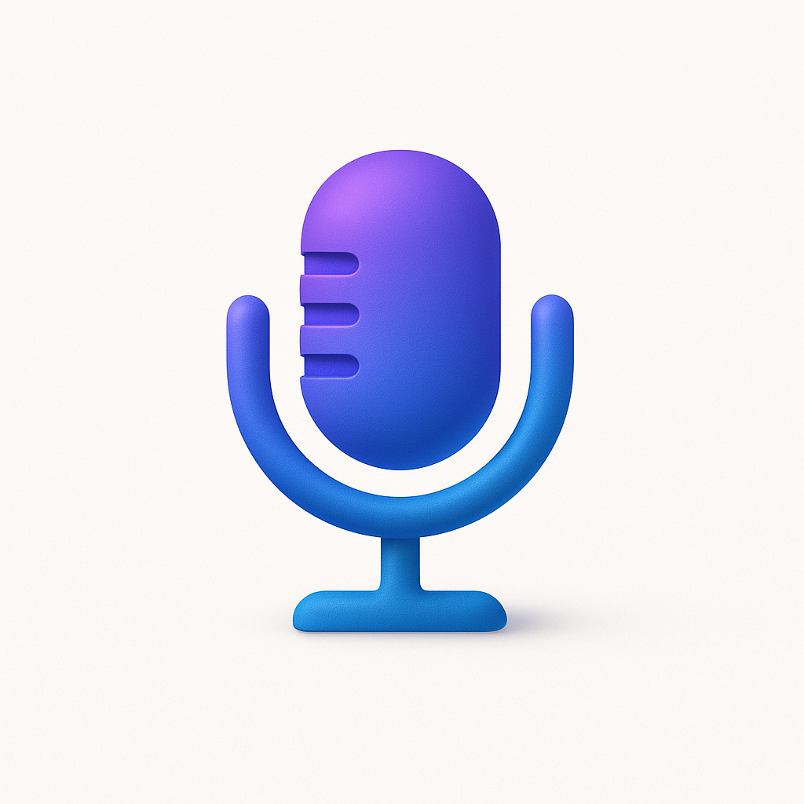

  
  <h1>Transcrybe</h1>
  
<strong>Fully Local Push-to-Transcribe</strong>

  
Lightweight voice transcription app that works entirely offline. Press the Function key to record, and get instant transcriptions. All processed locally on your machine. No Cloud, no Tracking, no Subscription.

## Key Features

- **100% Local** – All transcription happens on your device. Your voice data never touches the internet
- **One-Key Recording** – Press the Function key to start/stop recording from anywhere
- **Instant Results** – Get transcriptions in less than 1 second
- **Completely Free and Open Source**** – No monthly quotas, no subscription, just FOSS.
- **Simple & Fast** – Lightweight, minimal UI, maximum efficiency

---

## Demo

---

## Usage Guide

- **macOS** 14.6+ (Somona onwards) (native support)
- **Windows** app is under development (just starting), contributions welcome!
- Model file need to be constantly stored in memory for fast transcription, will take (40MB, 140MB, or 440MB depending on the model you choose)
- Use the menu bar item to launch settings panel or quit the app.
- Microphone access

---

## Quick Start

1. Download and install Transcrybe (if the permissions requests performs weird try quitting and restarting it)
2. Grant microphone and accessibility permissions when prompted
3. Select an input field and Press the **Function key** to start recording
4. Release the button to stop recording
5. Done! You should see the text in your selected input field.

---

## Credits

Transcrybe is powered by [**whisper.cpp**](https://github.com/ggerganov/whisper.cpp) – an amazing C++ implementation of OpenAI's Whisper that makes offline transcription blazingly fast. Big thanks to the whisper.cpp team for building such incredible infrastructure that made this project possible! 🙏
